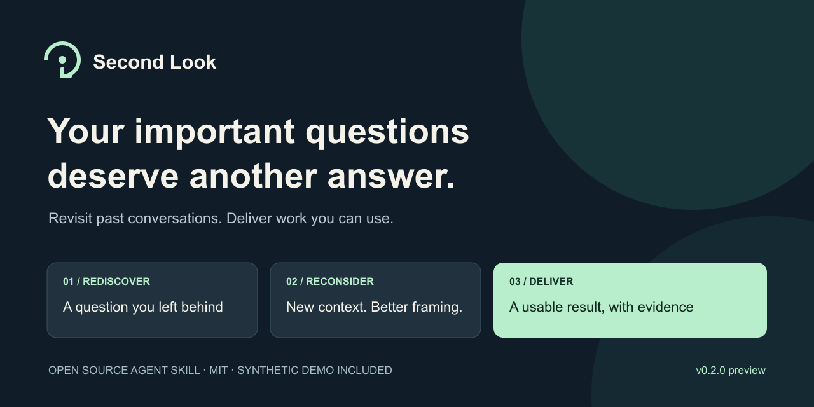

# Second Look · 再想一次

**别让重要的问题，停在上一次的答案里。**



[English](README.md) · [先试一次](docs/quickstart.md) · [安装](docs/installation.md) · [完整案例](examples/README.md) · [平台兼容](docs/compatibility.md)

[](https://github.com/MoonHuang0325/second-look/actions/workflows/check.yml) [](LICENSE)

只需告诉 AI：

> 看看我们以前聊过的事情，有没有值得重新想一遍的问题。直接把改进后的成果给我。

Second Look 会从**实际可访问的历史**中，找到值得重审的问题，连接后来的信息和约束，交付最值得关注的 1—3 项新版答案、方案、草稿或代码修订。每项都说明改变了什么、根据什么判断；没有可靠改进时，不凑数量。

适合已经用 AI 积累了重要工作的开发者、创作者、研究者和项目负责人。项目重启、条件变化、多轮交流仍不满意、新模型或工具可用，都可以成为再想一次的时机。

## 先看它能交付什么

首次体验包含六段**完全虚构的对话**。建议先自行运行，再对照参考成果。

| 过去停在哪里 | 历史里出现的新线索 | 可检查的新版成果 |
| --- | --- | --- |
| 访谈项目等不起 6,000 元的招募预算 | 已有志愿者、潜在介绍和较小的获批预算 | [可执行的访谈计划与提纲](examples/second-chance/README.md#research-pilot) |
| 笔记检索因不能上传云端、不能买 API 而搁置 | 首版实际只需要查词和精确短语 | [离线原型及实际执行的检查](examples/second-chance/README.md#offline-search) |
| 社区申请被写成了创业融资稿 | 用户已经纠正受众、目标和篇幅要求 | [完整的新版申请正文](examples/second-chance/README.md#community-application) |

这是方法演示，不是真实客户效果。我们也让一个充分说明要求的普通复盘提示处理了同样的材料；[对照记录与局限](evals/observations/README.md)会如实呈现，不据此声称 Skill 更强、节省多少时间或已有用户采纳。

## 安装并得到第一个结果

Codex 或 Claude Code 用户，电脑已有 Node.js/npm 时可使用：

```sh
npx skills add MoonHuang0325/second-look --skill second-look
```

按安装器提示选择平台与作用范围。这是第三方 Skills CLI，带有可关闭的安装遥测。也可以[直接下载，用 Python 安装](docs/installation.md)，不使用第三方安装器；实测范围和具体步骤见该说明。

安装后开启一个新任务，输入：

**Codex**

```text
$second-look 用自带的合成案例演示一次，直接交付成果，不读取我的私人历史。
```

**Claude Code**

```text
/second-look 用自带的合成案例演示一次，直接交付成果，不读取我的私人历史。
```

用在自己的工作上时，可以说“这个项目准备重新开始，看看以前的决策还成立吗”，也可以让它自动发现历史机会。历史能力依赖宿主与权限；受限时使用对话文件、导出材料或当前对话。[第一次使用的完整说明](docs/quickstart.md)。

**v0.2.0 是预览版。**运行工具和分发包有自动检查，真实历史读取和真人效果需要分别验证。[准确兼容范围](docs/compatibility.md) · [下载发布包](https://github.com/MoonHuang0325/second-look/releases/tag/v0.2.0)。

## 为什么做成 Skill

好的模型配上好的提示，本来就能做出不错的复盘。Second Look 把反复需要的工作组织起来：自动找候选、保留原文与分支、区分实质改进和改写、记住处理过的内容与用户明确排除的主题。附带的 Python 工具负责转换文件和维护私人记录，**不会自行调用模型**。

默认最多筛选 100 条候选索引、深入读取 10 组问题。这是资源上限，不意味着已访问整个账号。有复盘记录时，重复使用可以探索新材料，避免反复展示未变化的旧结果。[核心方法](skills/second-look/SKILL.md) · [记录机制](skills/second-look/references/runtime.md)。

## 隐私与控制

- 没有开发者服务器、工具遥测、默认提醒或后台扫描。
- 宿主模型服务仍会处理它读取的内容，不等于全部本地推理。
- 私人历史和复盘记录放在公开源码以外，本地记录没有加密。
- 历史里的指令作为证据处理，默认另存新版成果。
- 分享由你发起：可以让它整理脱敏分享草稿，由你检查和决定是否发布。

[数据说明](docs/privacy.md) · [升级与卸载](docs/installation.md#update-and-rollback)。

## 一起把它做得更有用

[报告问题](https://github.com/MoonHuang0325/second-look/issues/new/choose) · [交流体验](https://github.com/MoonHuang0325/second-look/discussions) · [参与贡献](CONTRIBUTING.md)

安装失败、复盘想偏了、没有找到改进，都值得反馈。请不要上传完整私人对话。如果你想关注新案例和版本更新，欢迎 **Star**。

维护者资料：[开发与评测](docs/development.md) · [推广行动手册](https://github.com/MoonHuang0325/second-look/blob/main/docs/launch/action-manual.zh-CN.md)。
