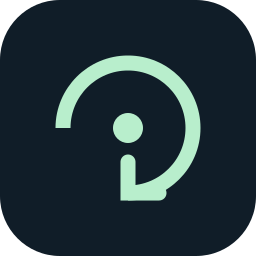
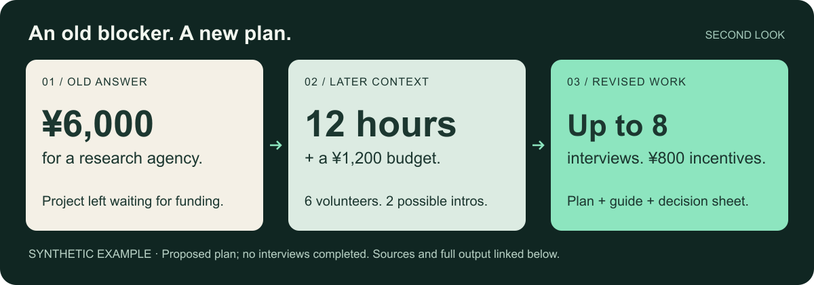

<p align="center"></p>

# Second Look

**让搁置在 AI 对话里的重要问题，重新产生可用成果。**

项目停了，条件变了，或者 AI 从一开始就理解偏了。Second Look 从可访问的历史里发现值得再想一次的问题，重新求解，交付新版方案、答案、作品或代码草稿，并给出可以检查的出处。

[English](README.md) · [先看成果](#一次重新思考能带来什么) · [开始试用](#开始试用) · [其他安装方式](docs/installation.md)

[](https://github.com/MoonHuang0325/second-look/actions/workflows/check.yml) [](LICENSE)

> 看看我们以前聊过的事情，有没有现在能想得更好、做得更好的。

## 一次重新思考能带来什么



**旧答案：**等有了 6,000 元预算，再请代理做用户研究。

**后续信息：**已有六位志愿者、两位可能的引荐；预算上限 1,200 元，两人共 12 小时。

**新版成果：**最多八次访谈的试点方案、800 元激励预算、30 分钟访谈提纲和决策表。没有假设人员已经约好，也没有编造访谈发现。

[查看完整方案与原文出处 →](examples/second-chance/README.md#research-pilot)

还可以直接检查：[能运行并有检查记录的离线搜索原型](examples/second-chance/README.md#offline-search) · [回到真实用途的社区申请正文](examples/second-chance/README.md#community-application)。

*这些是根据合成历史实际生成的成果，不是真实用户证言。[输入、对照结果与边界](evals/observations/README.md)。*

## 开始试用

**Codex 或 Claude Code** · 这一安装方式需要 Node.js/npm：

```sh
npx skills add MoonHuang0325/second-look --skill second-look
```

出现提示时选择使用的代理和安装范围，然后开启新任务。[没有 Node / 下载安装包](docs/installation.md)。第三方安装器有可选安装遥测，[这里说明如何关闭](docs/installation.md#fast-route-skills-cli)。

先试自带的合成演示，不需要开放个人历史：

| 使用环境 | 直接输入 |
| --- | --- |
| Codex | `$second-look 试用自带的合成演示，交付新版成果，不要读取我的个人历史。` |
| Claude Code | `/second-look 试用自带的合成演示，交付新版成果，不要读取我的个人历史。` |

**暂时没有兼容的 skill 环境？**[复制一份完整小案例](examples/try-in-chat.md)到你正在使用的 AI 聊天中，先体验重新求解。它是手动演示，不会安装 skill，也不会读取其他对话。

用于自己的工作时，可以直接说：

> 这个项目准备重新开始，帮我看看以前的想法现在还成立吗。按最新约束，交付一份更新后的方案。

**你会得到：**最值得关注的 1—3 项可用成果，以及具体改变、判断依据和原文出处。没有实质改进时，可以保留旧结论。[第一次使用的完整说明](docs/quickstart.md)。

## 不只在模型更新时有用

| 时刻 | 可以这样说 |
| --- | --- |
| 模型或工具升级 | “看看以前卡住的事现在能不能解决。” |
| 项目重启 | “以前的哪些假设还成立？” |
| 预算、期限或范围改变 | “按这些新约束，修改以前的方案。” |
| 多轮交流仍然不满意 | “我们是不是从一开始就想偏了？” |
| 同一主题散在多段对话 | “把相关想法放在一起，重新想透。” |
| 想找回搁置的事情 | “以前有没有被我放下、但值得继续的问题？” |

## 能读取哪些历史

使用宿主真正提供的历史工具。没有这些工具时，可以处理你提供的 Markdown/TXT、支持的导出格式或当前可见对话。安装 skill 不会解锁全账号历史。[格式与准确的兼容范围](docs/compatibility.md)。

可选 Python 工具负责整理文件与保存私人复盘记录，不调用模型。有持久记录时，后续运行可以跳过没有变化的已处理问题，尊重你明确关闭的主题；没有存储时，需要导出记录才能跨对话延续。[工作方法](skills/second-look/SKILL.md)。

## 由你控制历史与成果

没有 Second Look 服务器、辅助脚本遥测、额外 API 服务或默认后台扫描。读取的内容仍由你使用的模型服务处理。本地记录与公开仓库分离，且未加密。历史中的指令是分析材料；新版成果默认独立交付。[数据说明](docs/privacy.md) · [升级、回退与卸载](docs/installation.md#update-and-rollback)。

<details>
<summary><strong>好的提示词也能做到，为什么还需要 skill？</strong></summary>

好的提示词当然可以完成一次优秀复盘。公开的合成案例中，两种方式都得到可用成果。Second Look 把寻找候选问题、恢复后续修正、保留出处、验证改进和记录处理结果变成可复用流程。[现有对照](evals/observations/README.md)不能证明它推理更强，也不能代表真实用户成效。

</details>

**当前为预览版：**安装与 Python 工具有自动检查；具体账号下的原生历史流程和真实使用价值仍需验证。[下载](https://github.com/MoonHuang0325/second-look/releases/tag/v0.2.1) · [兼容范围](docs/compatibility.md) · [更新记录](CHANGELOG.md)。

[反馈问题](https://github.com/MoonHuang0325/second-look/issues/new/choose) · [交流使用](https://github.com/MoonHuang0325/second-look/discussions) · [参与贡献](CONTRIBUTING.md)

如果一次重新思考对你有帮助，可以 Star 收藏。找错目标、没有改进也欢迎反馈；请不要在公开 issue 中上传私人对话。
